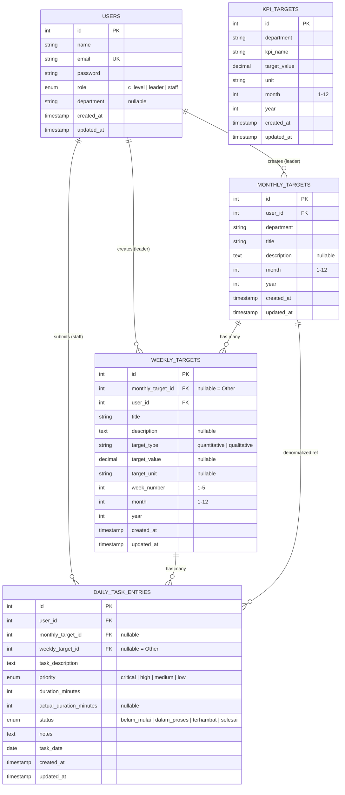
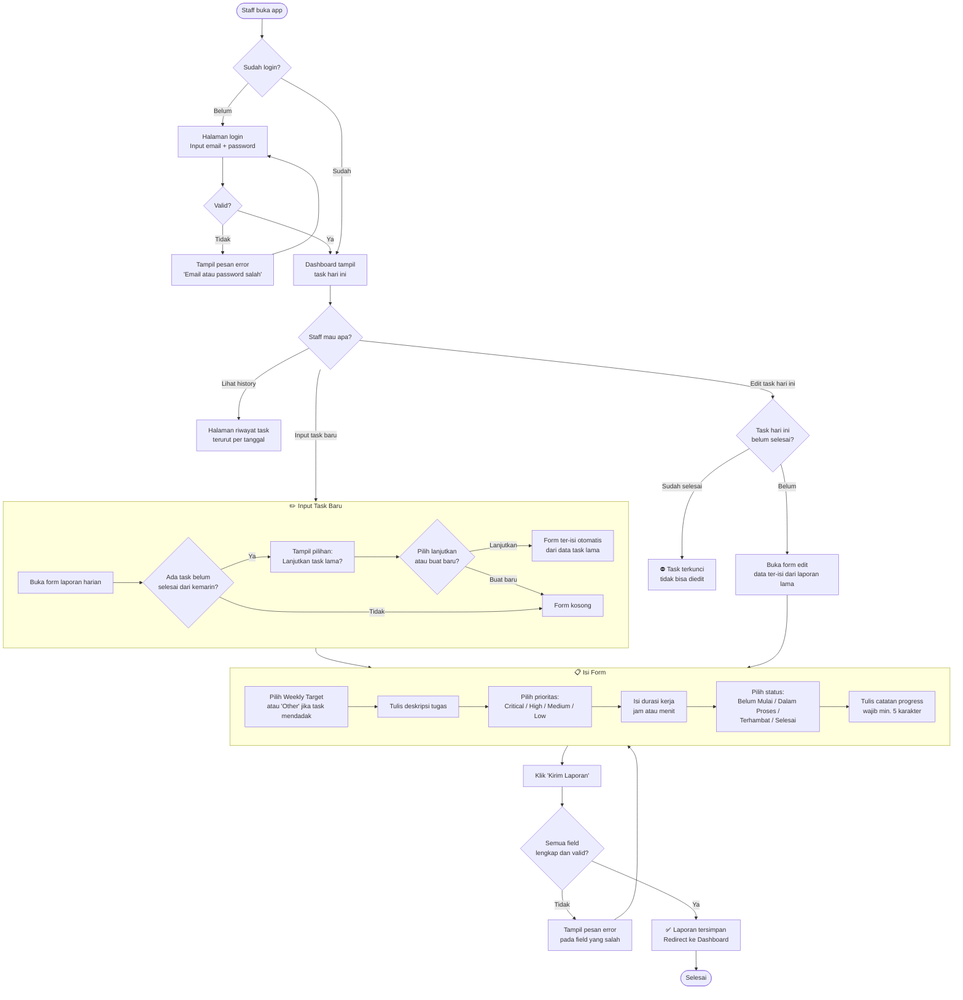

# PRD — Maxy Academy Performance Management System
**Version:** 2.0 (Revised based on Notul Rapat 12 Mei 2026)  
**Status:** In Development — MVP Phase  
**Last Updated:** 13 Mei 2026  
**PIC:** Adam (Developer), Ko Isaac (C-Level / Product Owner), Kak Fanny (HR/Ops)

---

## 📋 Daftar Isi

1. [Ringkasan Produk](#1-ringkasan-produk)
2. [Latar Belakang & Masalah](#2-latar-belakang--masalah)
3. [User Personas](#3-user-personas)
4. [MVP Scope](#4-mvp-scope)
5. [Arsitektur Sistem](#5-arsitektur-sistem)
6. [Model Data (ERD)](#6-model-data-erd)
7. [Use Case Diagram](#7-use-case-diagram)
8. [User Flow](#8-user-flow)
9. [Functional Requirements](#9-functional-requirements)
10. [Non-Functional Requirements](#10-non-functional-requirements)
11. [Roadmap & Prioritas](#11-roadmap--prioritas)
12. [Open Questions & Pending Decisions](#12-open-questions--pending-decisions)
13. [Revision History](#13-revision-history)

---

## 1. Ringkasan Produk

| | |
|---|---|
| **Nama Produk** | Maxy Academy Performance Management System |
| **Tujuan** | Menggantikan alur Google Form → Excel manual menjadi sistem terpusat berbasis web untuk tracking KPI dan target harian tim Maxy Academy |
| **Platform** | Web (mobile-first, dioptimasi untuk HP) |
| **Tech Stack** | Laravel 13, Blade, MySQL (Railway), SQLite (lokal) |
| **Deployment** | Railway.app |
| **GitHub** | https://github.com/damhacker04/performance-management-maxy |

### Tagline
> *"Dari Google Form ke sistem tracking yang real-time — Ko Isaac lihat progres tim tanpa harus tunggu laporan manual dari Bu Fanny."*

---

## 2. Latar Belakang & Masalah

### Kondisi Sebelumnya (Pain Points)

| # | Masalah | Dampak |
|---|---------|--------|
| 1 | Staff input laporan harian via **Google Form** | Data tersebar, tidak bisa di-query real-time |
| 2 | Bu Fanny **parsing manual** Google Form → Excel setiap hari | Bottleneck HR, data sering delay 1-2 hari |
| 3 | **42 staff** × rata-rata **7 task/hari** = ~294 entry/hari harus diproses manual | Tidak skalabel sama sekali |
| 4 | Ko Isaac tidak bisa lihat progres tim **real-time** | Keputusan manajerial lambat karena data tidak up-to-date |
| 5 | Tidak ada link antara **KPI target** dan **pekerjaan harian** | Staff kerja tanpa arah yang terukur |
| 6 | Field **"persentase progress"** di form lama mudah dimanipulasi | Data tidak reliable untuk evaluasi |

### Solusi

Sistem manajemen performa berbasis web dengan:
- **Hierarki target**: Monthly Target → Weekly Target → Daily Task
- **Role-based access**: C-Level lihat semua, Leader atur target dept-nya, Staff input laporan harian
- **Real-time visibility**: Ko Isaac bisa buka dashboard kapan saja
- **No more manual parsing**: Data langsung masuk DB, Bu Fanny tidak perlu buka-tutup Excel

---

## 3. User Personas

### 👔 Persona 1: Ko Isaac (C-Level)

| | |
|---|---|
| **Role di sistem** | `c_level` |
| **Department** | - (lintas semua departemen) |
| **Kebutuhan utama** | Lihat progress keseluruhan semua tim real-time tanpa minta laporan satu-satu |
| **Pain point** | Harus tunggu Bu Fanny compile data dulu baru bisa evaluasi kinerja |
| **Goal** | Buka app → langsung tahu tim mana yang on-track, terhambat, atau belum mulai |
| **Akses** | Semua data semua departemen. Satu-satunya yang bisa **input/edit KPI Organization** |

### 👤 Persona 2: Leader Departemen

| | |
|---|---|
| **Role di sistem** | `leader` |
| **Department** | Sales / Marketing / Product (masing-masing punya 1 leader) |
| **Kebutuhan utama** | Set target bulanan & mingguan untuk tim-nya, pantau progress staff |
| **Pain point** | Tidak tahu staff-nya kerja apa sampai laporan masuk, sering miss deadline |
| **Goal** | Set target di awal bulan → pantau weekly target → lihat daily task staff di dashboard |
| **Akses** | Data dept sendiri saja. Bisa lihat KPI tapi **tidak bisa edit** |
| **Pending** | ⚠️ Apakah leader juga perlu input daily task ke Ko Isaac? (Pending konfirmasi Kak Fanny) |

### 👷 Persona 3: Staff

| | |
|---|---|
| **Role di sistem** | `staff` |
| **Department** | Sales / Marketing / Product |
| **Kebutuhan utama** | Input laporan kerja harian dengan cepat, tahu task apa yang jadi prioritas |
| **Pain point** | Google Form terasa redundan, tidak ada feedback apakah laporan sudah dibaca |
| **Goal** | Buka app → pilih weekly target → input apa yang dikerjakan → selesai dalam < 2 menit |
| **Akses** | Hanya data milik sendiri. Tidak bisa lihat data staff lain |

---

## 4. MVP Scope

### ✅ Masuk MVP (Notul 12 Mei 2026)

**Departemen yang dilayani:** Sales, Marketing, Product IT  
**Departemen Phase 2:** Operational, GA, HR, Finance, Creative, Customer Support

> *"Fokus MVP terlebih dahulu ke divisi Sales, Marketing, Product. Operational & GA bisa menjadi pengembangan tahap berikutnya."* — Notul 12 Mei 2026

### Fitur MVP

| Fitur | Siapa | Status |
|-------|-------|--------|
| Login / Auth | Semua | ✅ Done |
| Dashboard real-time | Semua | ✅ Done |
| Monthly Target (CRUD) | Leader, C-Level | ✅ Done |
| Weekly Target standalone (CRUD + "Other") | Leader, C-Level | ✅ Done |
| Daily Task / Laporan Harian (CRUD + "Other") | Staff (+ Leader, pending) | ✅ Done |
| Task status (4 pilihan, tanpa persentase) | Staff | ✅ Done |
| Catatan wajib semua status | Staff | ✅ Done |
| KPI Organization (input c_level, view leader) | C-Level / Leader | 🔲 In Progress |
| Output reporting / export view | Semua | 🔲 Planned |
| MySQL persistent di Railway | Infra | ⛔ Blocker (user action) |

### ❌ Tidak Masuk MVP

- Multi-week task (task dengan due_date lintas minggu) → Phase 2
- KPI formula per dept (operasional pakai monthly completion rate) → Phase 2
- AI summary → Phase 2 (butuh data dulu)
- Onboarding dept Operational/GA → Phase 2

---

## 5. Arsitektur Sistem

### 5.1 High-Level Architecture

```
┌─────────────────────────────────────────────────────────┐
│                    USER DEVICES                         │
│          📱 Mobile (390px, primary)                     │
│          💻 Desktop (secondary)                         │
└────────────────────────┬────────────────────────────────┘
                         │ HTTPS
                         ▼
┌─────────────────────────────────────────────────────────┐
│                RAILWAY.APP (Production)                 │
│  ┌──────────────────────────────────────────────────┐   │
│  │           Laravel 13 App (FrankenPHP)            │   │
│  │                                                  │   │
│  │  ┌─────────────┐    ┌──────────────────────────┐ │   │
│  │  │  Routes +   │    │      Blade Views         │ │   │
│  │  │ Middleware  │───▶│  (Mobile-first, Maxy DS) │ │   │
│  │  └──────┬──────┘    └──────────────────────────┘ │   │
│  │         │                                        │   │
│  │  ┌──────▼──────┐    ┌──────────────────────────┐ │   │
│  │  │ Controllers │───▶│        Models            │ │   │
│  │  │             │    │  (Eloquent ORM)          │ │   │
│  │  └─────────────┘    └──────────┬───────────────┘ │   │
│  └───────────────────────────────┼──────────────────┘   │
│                                  │ Eloquent              │
│  ┌───────────────────────────────▼──────────────────┐   │
│  │              MySQL Database                      │   │
│  │  users | monthly_targets | weekly_targets        │   │
│  │  daily_task_entries | (kpi_targets - planned)    │   │
│  └──────────────────────────────────────────────────┘   │
└─────────────────────────────────────────────────────────┘

┌─────────────────────────────────────────────────────────┐
│              LOCALHOST (Development)                    │
│         XAMPP + SQLite + php artisan serve              │
└─────────────────────────────────────────────────────────┘
```

### 5.2 Role-based Middleware Flow

```
Request masuk
     │
     ▼
 auth middleware ──── belum login? ──▶ redirect /login
     │ sudah login
     ▼
 role check
     ├── role: c_level ──▶ semua route bisa diakses
     ├── role: leader  ──▶ monthly-targets, weekly-targets, daily-tasks, kpi (view-only)
     └── role: staff   ──▶ weekly-targets (view), daily-tasks
```

### 5.3 Struktur Route

```
GET  /dashboard                          → semua role
GET  /monthly-targets                    → leader, c_level
GET  /monthly-targets/create             → leader, c_level
POST /monthly-targets                    → leader, c_level
GET  /monthly-targets/{id}/edit          → leader, c_level
PATCH /monthly-targets/{id}              → leader, c_level
DELETE /monthly-targets/{id}             → leader, c_level

GET  /weekly-targets                     → leader, c_level
GET  /weekly-targets/create              → leader, c_level
POST /weekly-targets                     → leader, c_level
GET  /weekly-targets/{id}                → leader, c_level, staff
GET  /weekly-targets/{id}/edit           → leader, c_level
PATCH /weekly-targets/{id}               → leader, c_level
DELETE /weekly-targets/{id}              → leader, c_level

GET  /daily-tasks                        → semua role
GET  /daily-tasks/create                 → semua role
POST /daily-tasks                        → semua role
GET  /daily-tasks/{id}                   → semua role (owner only)
GET  /daily-tasks/{id}/edit              → semua role (owner only, today only)
PATCH /daily-tasks/{id}                  → semua role (owner only, today only)
PATCH /daily-tasks/{id}/complete         → semua role (owner only)

GET  /kpi                                → semua role
POST /kpi                                → c_level only        [PLANNED]
PATCH /kpi/{id}                          → c_level only        [PLANNED]
```

---

## 6. Model Data (ERD)

### 6.1 Entity Relationship Diagram



### 6.2 Penjelasan Nullable FK (Pola "Other")

```
monthly_target_id = NULL di weekly_targets
→ Weekly Target ini adalah "Other" — pekerjaan mingguan di luar planning bulanan

weekly_target_id = NULL di daily_task_entries
monthly_target_id = NULL di daily_task_entries
→ Daily Task ini adalah "Other" — task ad-hoc dari CEO/CTO/management lain
```

### 6.3 Business Rules Data

| Rule | Detail |
|------|--------|
| Satu user bisa punya banyak daily task per hari | Tidak ada unique constraint per (user_id, task_date) |
| `task_date` selalu hari ini saat create | Tidak bisa input task untuk hari lain |
| Edit daily task hanya boleh hari yang sama | `task_date->isToday()` check di controller |
| Task status "selesai" mengunci task dari edit | `canBeEdited()` return false kalau selesai |
| Notes wajib minimal 5 karakter untuk semua status | Validasi di backend + HTML minlength |
| Persentase progress tidak ada | Field `percent_done` sudah di-drop dari schema |

---

## 7. Use Case Diagram

### 7.1 Overview Use Cases per Role

```mermaid
flowchart LR
    subgraph ACTORS["👥 Aktor"]
        STAFF["👷 Staff"]
        LEADER["👔 Leader"]
        CLEVEL["🏢 C-Level\n(Ko Isaac)"]
    end

    subgraph UC_AUTH["🔐 Autentikasi"]
        UC_LOGIN["Login"]
        UC_LOGOUT["Logout"]
    end

    subgraph UC_MONTHLY["📅 Monthly Target"]
        UC_M1["Lihat Monthly Targets"]
        UC_M2["Buat Monthly Target"]
        UC_M3["Edit Monthly Target"]
        UC_M4["Hapus Monthly Target"]
    end

    subgraph UC_WEEKLY["📆 Weekly Target"]
        UC_W1["Lihat Weekly Targets"]
        UC_W2["Buat Weekly Target"]
        UC_W3["Buat Weekly Other"]
        UC_W4["Edit Weekly Target"]
        UC_W5["Hapus Weekly Target"]
    end

    subgraph UC_DAILY["📝 Daily Task"]
        UC_D1["Lihat Laporan Harian Sendiri"]
        UC_D2["Input Laporan Harian"]
        UC_D3["Lanjutkan Task Kemarin"]
        UC_D4["Edit Laporan (hari sama)"]
        UC_D5["Tandai Selesai"]
        UC_D6["Input Task Other/Ad-hoc"]
    end

    subgraph UC_KPI["📊 KPI Organization"]
        UC_K1["Lihat KPI"]
        UC_K2["Input / Edit KPI"]
    end

    subgraph UC_DASH["🏠 Dashboard"]
        UC_DB1["Lihat Dashboard"]
        UC_DB2["Lihat Semua Dept (C-Level)"]
    end

    %% Auth — semua
    STAFF --> UC_LOGIN
    LEADER --> UC_LOGIN
    CLEVEL --> UC_LOGIN
    STAFF --> UC_LOGOUT
    LEADER --> UC_LOGOUT
    CLEVEL --> UC_LOGOUT

    %% Dashboard
    STAFF --> UC_DB1
    LEADER --> UC_DB1
    CLEVEL --> UC_DB1
    CLEVEL --> UC_DB2

    %% Monthly — leader & c_level
    LEADER --> UC_M1
    LEADER --> UC_M2
    LEADER --> UC_M3
    LEADER --> UC_M4
    CLEVEL --> UC_M1
    CLEVEL --> UC_M2
    CLEVEL --> UC_M3
    CLEVEL --> UC_M4

    %% Weekly — leader & c_level buat, staff bisa lihat
    STAFF --> UC_W1
    LEADER --> UC_W1
    LEADER --> UC_W2
    LEADER --> UC_W3
    LEADER --> UC_W4
    LEADER --> UC_W5
    CLEVEL --> UC_W1
    CLEVEL --> UC_W2
    CLEVEL --> UC_W3
    CLEVEL --> UC_W4
    CLEVEL --> UC_W5

    %% Daily — semua role (staff utama)
    STAFF --> UC_D1
    STAFF --> UC_D2
    STAFF --> UC_D3
    STAFF --> UC_D4
    STAFF --> UC_D5
    STAFF --> UC_D6

    %% KPI — c_level edit, leader view
    LEADER --> UC_K1
    CLEVEL --> UC_K1
    CLEVEL --> UC_K2
```



### 7.2 Use Case: Input Daily Task (Detailed)



---

## 8. User Flow

> 💡 **Catatan:** User flow di bawah menggunakan bahasa sehari-hari, sesuai dengan tampilan aplikasi yang sebenarnya.

---

### 8.1 User Flow: Staff — Input Laporan Harian

**Siapa:** Staff Sales, Marketing, atau Product  
**Tujuan:** Melaporkan apa yang dikerjakan hari ini ke sistem

---

```
📱 BUKA APLIKASI
        │
        ▼
🔐 Halaman Login
   - Masukkan email kerja
   - Masukkan password (maxy2026)
   - Klik "Masuk"
        │
        ▼
🏠 DASHBOARD (Beranda)
   Kamu langsung lihat:
   ✓ Target minggu ini
   ✓ Task yang sudah kamu input hari ini
   ✓ Status task (Belum Mulai / Dalam Proses / Terhambat / Selesai)
        │
        ▼
➕ Klik tombol "+ Tambah Laporan" (atau tab "Tugas")
        │
        ├── [ADA task kemarin yang BELUM selesai?]
        │         │
        │         ▼
        │   📋 Muncul daftar task kemarin yang masih pending
        │   Pilihan: "Lanjutkan task ini" → form ter-isi otomatis
        │         │
        │         └──────────────┐
        │                        ▼
        └──── [Task baru] ──▶ 📝 FORM LAPORAN HARIAN
                                  │
                                  ▼
                         Isi 6 hal ini:
                         ┌─────────────────────────────────────┐
                         │ 1. Target Minggu Ini                │
                         │    └─ Pilih dari daftar target yang │
                         │       sudah dibuat Leader kamu      │
                         │    └─ Atau pilih "Other" kalau      │
                         │       task mendadak dari Ko Isaac   │
                         │                                     │
                         │ 2. Deskripsi tugas                  │
                         │    └─ Tulis singkat apa yang        │
                         │       kamu kerjakan                 │
                         │                                     │
                         │ 3. Prioritas                        │
                         │    └─ 🔴 Critical / 🟠 High /       │
                         │       🟡 Medium / 🔵 Low            │
                         │                                     │
                         │ 4. Durasi kerja                     │
                         │    └─ Berapa jam/menit?             │
                         │                                     │
                         │ 5. Status saat ini                  │
                         │    └─ Belum Mulai / Dalam Proses /  │
                         │       Terhambat / Selesai           │
                         │                                     │
                         │ 6. Catatan / Progress ⚠️ WAJIB      │
                         │    └─ Jelaskan apa yang sudah       │
                         │       dikerjakan / apa hambatannya  │
                         │    └─ Minimal 5 karakter            │
                         └─────────────────────────────────────┘
                                  │
                                  ▼
                         Klik "Kirim Laporan"
                                  │
                                  ▼
                         ✅ Berhasil! Balik ke Dashboard
                            Laporan kamu langsung terbaca
                            oleh Leader & Ko Isaac
```

**Catatan penting untuk Staff:**
- Laporan bisa **diedit sampai tengah malam hari yang sama**
- Kalau sudah klik "Tandai Selesai" → laporan **terkunci selamanya**
- Task kemarin yang belum selesai → buat laporan lanjutan hari ini (bukan edit yang lama)

---

### 8.2 User Flow: Leader — Set Target & Pantau Tim

**Siapa:** Leader Sales / Marketing / Product  
**Tujuan:** Set target bulanan + mingguan untuk tim, pantau progress

---

```
📱 BUKA APLIKASI
        │
        ▼
🔐 Login → Masuk sebagai Leader
        │
        ▼
🏠 DASHBOARD
   Kamu lihat:
   ✓ Summary progress tim hari ini
   ✓ Berapa task yang Selesai / Dalam Proses / Terhambat
   ✓ Weekly target yang aktif minggu ini
        │
        ▼
─── ALUR SET TARGET (awal bulan) ──────────────────────────

LANGKAH 1: Buat Monthly Target
  ├─ Klik tab "Monthly" di menu bawah
  ├─ Klik "+ Tambah Target Bulanan"
  ├─ Isi:
  │   • Judul target (contoh: "Capai 200 leads Sales Mei 2026")
  │   • Deskripsi (opsional)
  │   • Bulan & Tahun
  ├─ Klik "Simpan"
  └─ ✅ Target bulanan tersimpan

LANGKAH 2: Buat Weekly Target (per minggu)
  ├─ Klik tab "Weekly" di menu bawah
  ├─ Klik "+ Tambah Target Mingguan"
  ├─ Isi:
  │   • Terikat Monthly Target mana? (atau "Other" kalau bebas)
  │   • Judul target minggu ini
  │   • Minggu ke- (1/2/3/4/5)
  │   • Tipe target: Kuantitatif (ada angkanya) / Kualitatif
  │   • Kalau kuantitatif: angka target + satuan (leads, deals, dll)
  ├─ Klik "Simpan"
  └─ ✅ Staff tim kamu sudah bisa lihat target ini

─── ALUR PANTAU TIM (harian) ────────────────────────────────

Cek Dashboard setiap hari:
  ✓ Siapa yang sudah input laporan?
  ✓ Ada yang terhambat?
  ✓ Task apa yang sudah selesai?

Lihat KPI:
  ├─ Klik tab "KPI" di menu bawah
  ├─ Lihat KPI Organization yang sudah diset Ko Isaac
  └─ ⚠️ Kamu hanya BISA LIHAT, tidak bisa edit
```

---

### 8.3 User Flow: C-Level (Ko Isaac) — Pantau Semua & Set KPI

**Siapa:** Ko Isaac (C-Level)  
**Tujuan:** Lihat semua departemen, set KPI Organization, evaluasi kinerja tim

---

```
📱 BUKA APLIKASI
        │
        ▼
🔐 Login → Masuk sebagai C-Level
        │
        ▼
🏠 DASHBOARD
   Ko Isaac lihat:
   ✓ Progress SEMUA departemen (Sales + Marketing + Product)
   ✓ Task hari ini semua tim
   ✓ Yang terhambat di tim mana
   ✓ Perbandingan antar departemen
        │
        ├─── LIHAT DETAIL DEPARTEMEN
        │     ├─ Klik nama dept di dashboard
        │     ├─ Lihat semua weekly target dept tersebut
        │     └─ Lihat daily task semua staff dept tersebut
        │
        ├─── SET / EDIT KPI ORGANIZATION  [Fitur ini hanya Ko Isaac]
        │     ├─ Klik tab "KPI"
        │     ├─ Klik "+ Tambah KPI" atau edit yang ada
        │     ├─ Isi:
        │     │   • Nama KPI (contoh: "Revenue Bulanan Sales")
        │     │   • Target angka
        │     │   • Satuan (Rupiah / Leads / Deals / dll)
        │     │   • Departemen
        │     │   • Bulan & Tahun
        │     └─ Klik "Simpan"
        │
        └─── BUAT TARGET (kalau perlu)
              ├─ Bisa buat Monthly Target untuk dept mana pun
              └─ Bisa buat Weekly Target untuk dept mana pun
```

---

### 8.4 User Flow: Skenario "Other" (Task Ad-hoc)

**Situasi:** Ko Isaac tiba-tiba minta Budi (staff Sales) untuk handle sesuatu di luar planning minggu ini.

```
Budi buka app → Klik "+ Laporan Harian"
        │
        ▼
Di field "Target Minggu Ini":
   ← Biasanya pilih salah satu target yang ada →
   Tapi kali ini Budi pilih:

   🗂️ "Other (task tambahan dari CEO/CTO)"
        │
        ▼
Budi isi deskripsi:
   "Meeting mendadak dengan vendor partnership per permintaan Ko Isaac"
        │
        ▼
Budi isi catatan:
   "Rapat 2 jam dengan vendor X, output: MOU draft selesai dibahas"
        │
        ▼
✅ Laporan tersimpan dengan label "Task Tambahan (Other)"
   Ko Isaac bisa lihat task ini di dashboard dengan badge khusus
```

---

### 8.5 User Flow: Lanjutkan Task dari Hari Sebelumnya

**Situasi:** Hari Selasa, Rani punya task yang kemarin (Senin) masih "Dalam Proses".

```
Rani buka app Selasa pagi → Klik "+ Laporan Harian"
        │
        ▼
⚠️ Muncul banner kuning:
   "Lanjutkan task sebelumnya? (1 belum selesai)"
   └─ Task kemarin: "Bikin deck proposal Q2" — Dalam Proses
        │
        ├─ Klik task kemarin → Form ter-isi otomatis:
        │   • Target Minggu: sama seperti kemarin
        │   • Deskripsi: "Lanjut: Bikin deck proposal Q2"
        │   • Prioritas: sama seperti kemarin
        │
        └─ Rani ubah yang perlu:
            • Deskripsi: "Finalisasi deck proposal Q2 — revisi slide 5-8"
            • Status: ubah ke "Selesai" (karena sudah kelar hari ini)
            • Catatan: "Deck sudah final, sudah kirim ke Ko Isaac via email"
                │
                ▼
            Klik "Kirim Laporan" → ✅ Tersimpan sebagai laporan Selasa
            Task Senin tetap tercatat sebagai "Dalam Proses" (history)
```

---

## 9. Functional Requirements

### 9.1 Autentikasi

| ID | Requirement |
|----|-------------|
| AUTH-01 | Sistem mendukung login dengan email + password |
| AUTH-02 | Session aktif selama browser tidak ditutup |
| AUTH-03 | Redirect ke halaman login kalau belum auth |
| AUTH-04 | 3 role: `c_level`, `leader`, `staff` |
| AUTH-05 | Middleware memblokir akses ke route yang tidak sesuai role |

### 9.2 Monthly Target

| ID | Requirement |
|----|-------------|
| MT-01 | Leader bisa buat Monthly Target untuk dept-nya sendiri |
| MT-02 | C-Level bisa buat Monthly Target untuk dept mana pun |
| MT-03 | Monthly Target berisi: judul, deskripsi (opsional), bulan, tahun, dept |
| MT-04 | Leader hanya bisa lihat Monthly Target dept-nya sendiri |
| MT-05 | C-Level bisa lihat semua Monthly Target semua dept |
| MT-06 | Leader/C-Level bisa edit dan hapus Monthly Target yang mereka buat |

### 9.3 Weekly Target

| ID | Requirement |
|----|-------------|
| WT-01 | Weekly Target bisa dikaitkan ke Monthly Target tertentu |
| WT-02 | Weekly Target bisa dibuat tanpa Monthly Target (kategori "Other") |
| WT-03 | Weekly Target berisi: judul, deskripsi, minggu ke-, tipe target, nilai target (kalau kuantitatif) |
| WT-04 | Tipe target: `quantitative` (ada angka + satuan) atau `qualitative` (deskriptif) |
| WT-05 | Leader bisa lihat Weekly Target dept-nya + semua "Other" miliknya |
| WT-06 | Staff bisa lihat Weekly Target dept-nya (untuk dipilih saat input daily task) |
| WT-07 | Weekly Target "Other" ditampilkan dengan badge khusus (amber) |

### 9.4 Daily Task (Laporan Harian)

| ID | Requirement |
|----|-------------|
| DT-01 | Staff bisa input laporan harian — task_date selalu hari ini |
| DT-02 | Laporan bisa tanpa Weekly Target (kategori "Other" / task ad-hoc) |
| DT-03 | Field wajib: deskripsi tugas, prioritas, durasi, status, catatan |
| DT-04 | Catatan minimal 5 karakter — berlaku untuk SEMUA status |
| DT-05 | 4 status: Belum Mulai, Dalam Proses, Terhambat, Selesai |
| DT-06 | 4 prioritas: Critical, High, Medium, Low |
| DT-07 | Tidak ada field persentase progress |
| DT-08 | Laporan bisa diedit sampai akhir hari yang sama, ATAU sampai ditandai "Selesai" |
| DT-09 | Laporan yang ditandai "Selesai" terkunci permanen — tidak bisa diedit |
| DT-10 | Task kemarin yang masih "Dalam Proses"/"Terhambat" muncul sebagai saran "Lanjutkan" |
| DT-11 | "Lanjutkan" dari task lama = buat laporan baru (bukan edit laporan lama) |
| DT-12 | Staff hanya bisa lihat laporan miliknya sendiri |

### 9.5 KPI Organization

| ID | Requirement |
|----|-------------|
| KPI-01 | Hanya C-Level yang bisa input/edit KPI Organization |
| KPI-02 | Leader bisa lihat KPI tapi tidak bisa edit |
| KPI-03 | KPI berisi: nama KPI, target angka, satuan, departemen, bulan, tahun |
| KPI-04 | Tampilkan KPI per departemen di halaman KPI |

### 9.6 Dashboard

| ID | Requirement |
|----|-------------|
| DB-01 | Tampilkan ringkasan task hari ini per user |
| DB-02 | Tampilkan weekly target yang aktif di minggu berjalan |
| DB-03 | C-Level bisa lihat semua departemen di dashboard |
| DB-04 | Leader bisa lihat semua staff dept-nya di dashboard |
| DB-05 | Staff hanya lihat task miliknya sendiri |

---

## 10. Non-Functional Requirements

| Kategori | Requirement |
|---------|-------------|
| **Performance** | Halaman load < 2 detik di koneksi 4G |
| **Mobile-first** | Layout optimal di layar 390px (iPhone), semua fungsi utama bisa dilakukan di HP |
| **Accessibility** | Contrast ratio teks minimum WCAG AA (4.5:1) |
| **Security** | Semua route diproteksi auth middleware; owner-check di setiap edit/delete |
| **Data integrity** | Nullable FK untuk "Other" dengan konsisten — tidak ada orphan records |
| **Reliability** | DB Railway persistent (MySQL) — tidak reset saat redeploy |
| **Browser support** | Chrome mobile, Safari iOS, minimal |

---

## 11. Roadmap & Prioritas

### 🔥 P0 — MVP Blocker (selesaikan dulu)

| # | Fitur | Status | PIC |
|---|-------|--------|-----|
| 1 | KPI Organization CRUD (c_level edit, leader view) | 🔲 In Progress | Dev |
| 2 | MySQL Railway persistent | ⛔ Blocker | User (Railway dashboard) |
| 3 | Output reporting / export view | 🔲 Planned | Dev |

### 🟡 P1 — Polish MVP

| # | Fitur | Status | Notes |
|---|-------|--------|-------|
| 4 | Leader daily task input | ⏳ Pending | Tunggu konfirmasi Kak Fanny |
| 5 | Quick-add daily task UX | 🔲 Planned | Data: 7 task/staff/hari avg |
| 6 | Filter & search di riwayat task | 🔲 Planned | - |

### 🔵 Phase 2 — Post-MVP

| # | Fitur | Notes |
|---|-------|-------|
| 7 | Onboarding dept Operational, GA, HR, Finance, Creative, CS | Per keputusan management |
| 8 | Multi-week task (field `due_date`) | Untuk procurement/hiring |
| 9 | KPI formula otomatis per dept | Monthly completion rate, dll |
| 10 | AI summary laporan | Butuh data historis dulu |
| 11 | Notifikasi / reminder | Belum masuk scope |

---

## 12. Open Questions & Pending Decisions

| # | Pertanyaan | PIC untuk jawab | Impact |
|---|------------|-----------------|--------|
| OQ-01 | Apakah **leader juga perlu input daily task** (laporan ke Ko Isaac)? | Kak Fanny | Menentukan menu "Tugas" untuk role leader |
| OQ-02 | Apakah Ko Isaac set target spesifik **per leader** (bukan per dept)? | Ko Isaac | Menentukan apakah perlu relasi KPI → User |
| OQ-03 | Task lintas minggu di Operational — cara pelaporannya saat ini? | Kak Fanny | Phase 2 design decision |
| OQ-04 | Task mendadak dari Ko Isaac — perlu flag khusus "from management"? | Ko Isaac | Enhancement untuk "Other" category |
| OQ-05 | Berapa dept yang masuk **MVP** tepat? (3 atau lebih)? | Ko Isaac | Scope creep risk |

---

## 13. Revision History

| Versi | Tanggal | Perubahan | Oleh |
|-------|---------|-----------|------|
| 1.0 | ~Awal Mei 2026 | PRD awal berdasarkan Rapat 1 (sistem dasar) | Adam |
| 1.5 | ~8 Mei 2026 | Update: tambah "Other", role leader, sistem nested route | Adam |
| 2.0 | 13 Mei 2026 | **Revisi mayor** berdasarkan Notul Rapat 12 Mei 2026: drop percent_done, decouple menu Monthly/Weekly, 4 menu final (Home/Monthly/Weekly/KPI), KPI Organization c_level only, MVP = 3 dept, hapus semua asumsi yang tidak ada di notul | Adam |

---

## Appendix A: Design System

| Token | Nilai |
|-------|-------|
| Primary (Navy) | `#232E66` |
| CTA (Amber) | `#FBB041` |
| Success | `#16A571` |
| Danger | `#EF4444` |
| Warning | `#F59E0B` |
| Font | Figtree (Google Fonts) |
| Max width | 390px (mobile-first) |
| Border radius card | `rounded-2xl` (16px) |

## Appendix B: Notul Rapat (Referensi)

Semua keputusan di PRD ini mengacu pada:
- **Notul Rapat 12 Mei 2026** (dokumen otoritatif terbaru)
- **Notul Rapat sebelumnya** (superceded oleh notul 12 Mei untuk semua poin yang konflik)

**Prinsip:** Kalau ada ambiguitas → selalu tanyakan dulu ke Kak Fanny / Ko Isaac, jangan asumsi.
